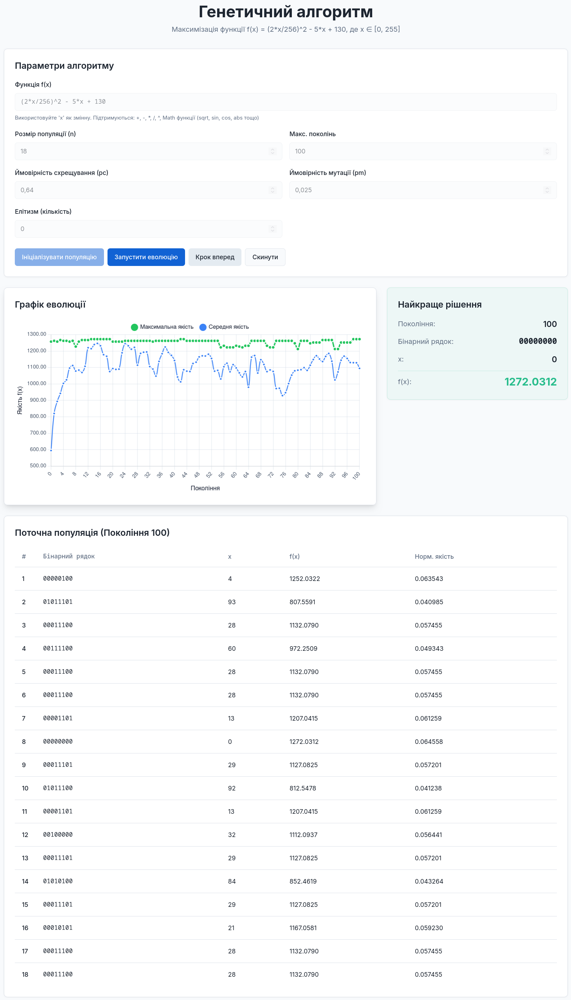

# Genetic Algorithm Visualizer

A web-based educational tool for visualizing and understanding genetic algorithms through step-by-step evolution simulation.

## Description

This project provides an interactive platform for learning and experimenting with genetic algorithms (GA). It solves the function optimization problem by finding the maximum value of a user-defined mathematical function using evolutionary computation techniques. The application is designed for students, researchers, and anyone interested in understanding how genetic algorithms work through visual feedback and real-time data.

**Problem solved:** Demonstrates how genetic algorithms can find optimal solutions to mathematical optimization problems using principles inspired by natural selection and evolution.

## Features

- **Interactive Parameter Configuration**: Adjust population size, crossover rate, mutation rate, generations, and elitism
- **Custom Function Input**: Define any mathematical function `f(x)` to optimize (supports standard math operations and functions)
- **Step-by-Step Evolution**: Run the algorithm generation by generation or execute complete evolution cycles
- **Real-time Visualization**: 
  - Population table showing binary representation, decimal values, fitness, and normalized fitness
  - Evolution chart tracking maximum and average fitness across generations
  - Best solution display with detailed information
- **Elitism Support**: Preserve top-performing individuals across generations
- **Fitness Shifting**: Automatic handling of negative fitness values for proper roulette wheel selection

## Screenshots

### Main Interface

*The main application interface showing parameter controls, population table, and evolution chart*

## Technology Stack

### Frontend
- **React 18** - UI library for building interactive interfaces
- **TypeScript** - Type-safe JavaScript for robust code
- **Vite** - Fast build tool and development server
- **Tailwind CSS** - Utility-first CSS framework for styling

### Visualization & Charts
- **Chart.js** - Powerful charting library
- **react-chartjs-2** - React wrapper for Chart.js

### UI Components
- **shadcn/ui** - High-quality accessible components
- **Radix UI** - Unstyled, accessible component primitives

### Utilities
- **class-variance-authority** - Component variant management
- **clsx** & **tailwind-merge** - Conditional className utilities
- **sonner** - Toast notifications

## Directory Structure

```
src/
├── components/
│   ├── ui/                      # shadcn/ui components
│   ├── BestSolutionInfo.tsx     # Displays best individual
│   ├── EvolutionChart.tsx       # Chart.js evolution graph
│   ├── ParametersPanel.tsx      # GA parameter controls
│   └── PopulationTable.tsx      # Population data table
├── lib/
│   ├── geneticAlgorithm.ts      # Core GA implementation
│   └── utils.ts                 # Utility functions
├── pages/
│   ├── Index.tsx                # Main application page
│   └── NotFound.tsx             # 404 page
├── App.tsx                      # Root component with routing
├── index.css                    # Global styles & design tokens
└── main.tsx                     # Application entry point
```

## Installation and Setup

1. **Clone the repository**
   ```bash
   git clone <GIT_URL>
   cd <PROJECT_NAME>
   ```

2. **Install dependencies**
   ```bash
   npm install
   ```

3. **Start development server**
   ```bash
   npm run dev
   ```

4. **Open in browser**
   Navigate to `http://localhost:5173`

### Build for Production

```bash
npm run build
```

The production-ready files will be in the `dist/` directory.

## License

MIT License - see [LICENSE](LICENSE) file for details.
